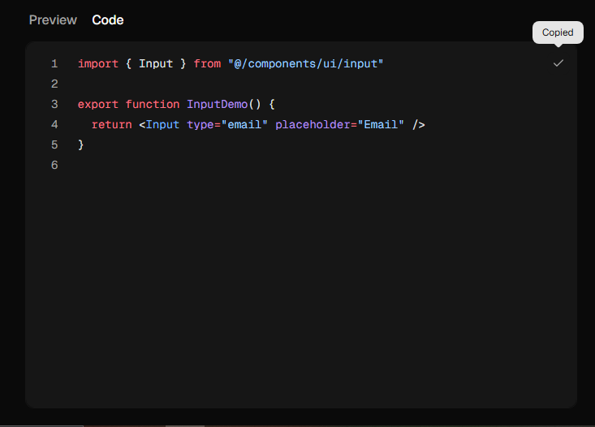

# ShadCn items

## To use shadcn on this project

Example:

Go to <https://ui.shadcn.com/docs/components/input>
Install : ->
npm shadcn@latest add input

you get this

put it in src/core/{componentName}/{componentName}.jsx

Note: Component name is the component you are working at
